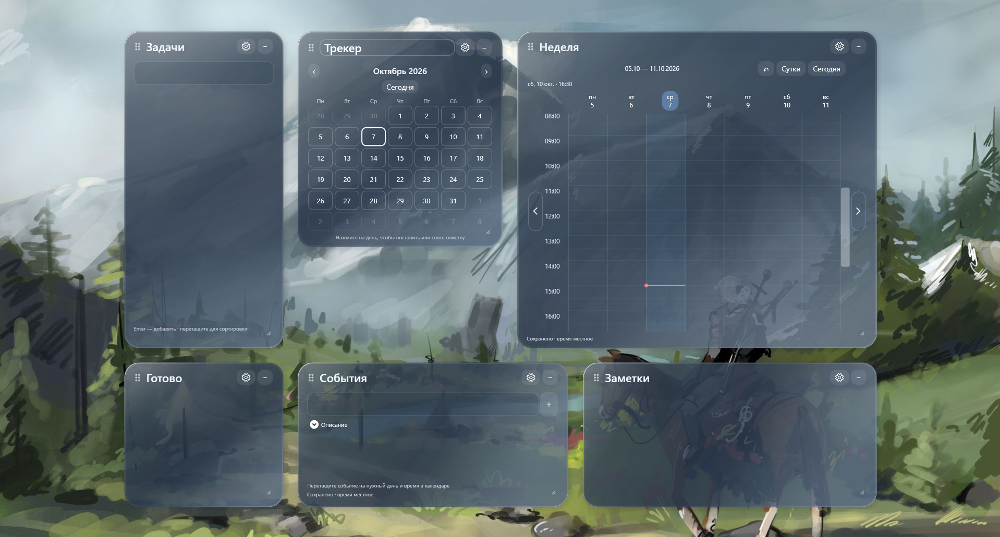

# DesktopPlanner 1.0.2 — локальные виджеты.

Нативные виджеты Windows на .NET 10, WPF, MVVM и SQLite. Реализованы задачи, заметки, недельный календарь, входящие события, управление окнами, миграции базы. Все данные хранятся локально; синхронизации с внешними календарями нет.

